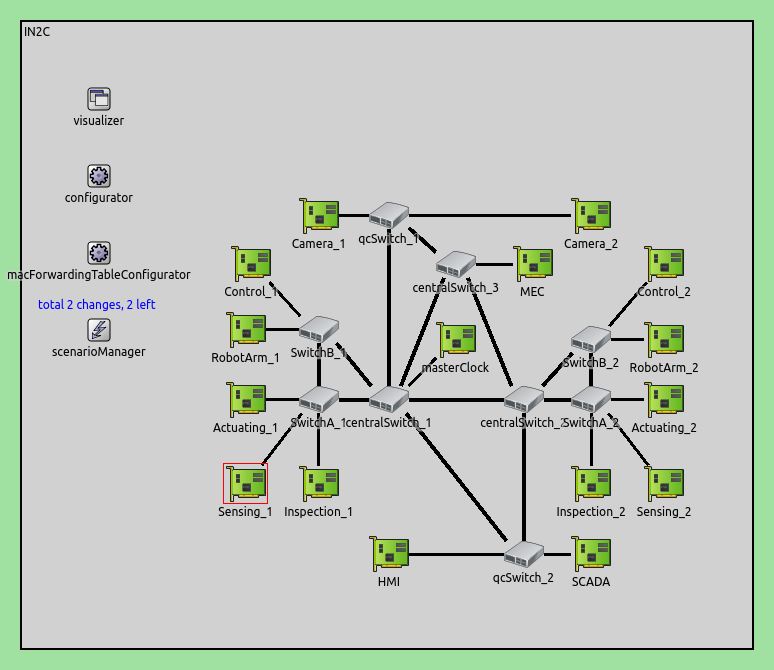
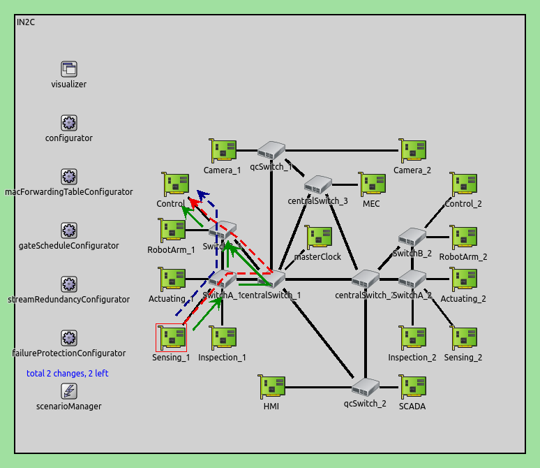
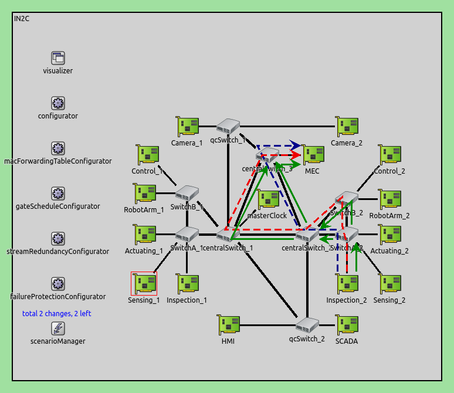

# IN2C: Industrial Network Simulation in OMNeT++/INET

This project simulates a **Time-Sensitive Networking (TSN)** based industrial Ethernet architecture using **OMNeT++** and the **INET framework**. It models multiple production cells with real-time traffic, gPTP synchronization, fault-tolerant paths, and failure recovery using FRER (Frame Replication and Elimination for Reliability).

---

## How to Run the Simulation

### Prerequisites
- OMNeT++ (v6.x recommended)
- INET Framework (compatible with your OMNeT++ version)
- CMake (if building outside IDE)

### Steps
1. Clone or download the repository.
2. Open the project in OMNeT++ IDE or terminal.
3. Build the project:  
   - IDE: `Project > Build All`  
   - CLI: `make`
4. Run the simulation with the config:

## Project Structure
```
IN2C/
├── src/              # NED and C++ modules
├── simulations/      # omnetpp.ini, XML scenario configs
├── images/           # Architecture diagrams or figures
├── linkfailure.xml   # Link failure configuration
├── cellfailure.xml   # Node failure configuration
```


## Features
- gPTP time synchronization
- TSN redundancy with FRER
- Simulated link and node failures
- Realistic traffic flows (sensors, PLCs, cameras)


---

## Configuration Files

### `in2cConfig.ini`
Main simulation file that defines:
- Number of production cells
- Traffic flow between devices (sensors, actuators, SCADA, camera)
- Logging, simulation time, and runtime parameters
- Integration with failure scenarios (see XML below)

### `cellfailure.xml`
Describes node failure scenarios for testing redundancy and FRER. Includes timed shutdowns of specific devices (e.g., switches or robot controllers).

### `linkfailure.xml`
Models link failures (e.g., broken Ethernet segments) at specific timestamps. Used to evaluate recovery and robustness.

---

## Scenarios Covered

1. **Normal Operation**
   - All production cells operate with synchronized sensing, actuation, inspection, and SCADA flows.
   - Periodic and event-based traffic across all units.
   

   - 
2. **Link Failure Scenario**
   - Triggers failure in inter-cell links or uplinks to central switch.
   - Validates frame replication, FRER recovery, and minimal packet loss.


 
3. **Node Failure Scenario**
   - Simulates controller/sensor/switch failure mid-simulation.
   - Tests flow rerouting, recovery time, and downstream effect.



---

## Extending the Simulation

You can extend this project by:
- Adding more production cells or topologies in `IN2C.ned`
- Configuring new `.xml` scenarios for time-based degradation or congestion
- Exporting metrics from `.vec` or `.sca` files for result analysis

---

## License

This project is licensed under the **GNU Lesser General Public License**. 
See [LICENSE](https://www.gnu.org/licenses/lgpl-3.0.en.html#license-text) for details.

## Academic Attribution

If you make use of this framework, please include the following reference in any resulting publication:
```markdown
@INPROCEEDINGS{10152101,
  author={Seliem, Mohamed and Zahran, Ahmed and Pesch, Dirk},
  booktitle={2022 IEEE 8th World Forum on Internet of Things (WF-IoT)}, 
  title={TSN-based Industrial Network Performance Analysis}, 
  year={2022},
  volume={},
  number={},
  pages={1-7},
  keywords={Performance evaluation;Analytical models;Automation;Simulation;Telecommunication traffic;Jitter;Performance analysis;Time Sensitive Networking;Industrial Networks;IIoT;Resource management;OMNET++},
  doi={10.1109/WF-IoT54382.2022.10152101}}

```
---

**Developed for research and educational use.**

